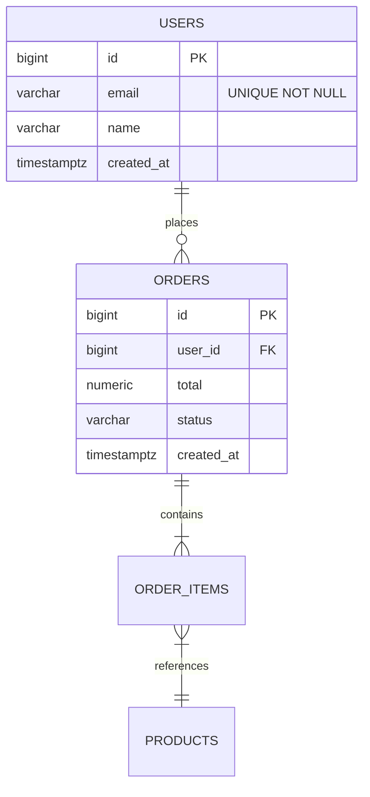

# Modelado Relacional

Cómo diseñar schemas SQL bien estructurados.

## Proceso de modelado

### 1. Identificar entidades

Sustantivos del dominio: User, Order, Product, Category.

### 2. Identificar relaciones

Verbos entre entidades:
- "User **places** Order" → 1:N
- "Order **contains** Products" → N:M (con tabla intermedia)
- "User **has** Address" → 1:N (puede tener varias)

### 3. Atributos

Datos de cada entidad: nombre, email, precio, fecha.

### 4. Claves

- **Primary Key (PK)**: identifica el row
- **Foreign Key (FK)**: referencia a otra tabla
- **Natural Key**: campo del dominio que es único (email, SKU)
- **Surrogate Key**: ID artificial (autoincremental, UUID)

### 5. Normalizar

Aplicar formas normales para evitar redundancia.

### 6. Indexes y constraints

Después del schema base, agregar:
- Indexes para queries frecuentes
- UNIQUE constraints en natural keys
- CHECK constraints en reglas de negocio
- NOT NULL donde aplique

## Formas normales (resumen práctico)

### 1NF: valores atómicos

❌ Mal:
```sql
CREATE TABLE users (id INT, name TEXT, phones TEXT);  -- "555-1234, 555-5678"
```

✅ Bien:
```sql
CREATE TABLE users (id INT PRIMARY KEY, name TEXT);
CREATE TABLE user_phones (
  id INT PRIMARY KEY,
  user_id INT REFERENCES users(id),
  phone TEXT NOT NULL
);
```

### 2NF: sin dependencias parciales

Si tienes PK compuesta, todos los atributos no-clave deben depender de TODA la PK.

❌ Mal:
```sql
CREATE TABLE order_items (
  order_id INT,
  product_id INT,
  product_name TEXT,  -- depende solo de product_id, no de order_id
  quantity INT,
  PRIMARY KEY (order_id, product_id)
);
```

✅ Bien: `product_name` va en tabla `products`.

### 3NF: sin dependencias transitivas

Atributos no-clave no deben depender de otros atributos no-clave.

❌ Mal:
```sql
CREATE TABLE employees (
  id INT PRIMARY KEY,
  name TEXT,
  department_id INT,
  department_name TEXT  -- depende de department_id
);
```

✅ Bien: tabla `departments` separada.

### En la práctica

- **Apuntar a 3NF** en diseño inicial
- **Denormalizar selectivamente** si profile muestra problema
- **No memorizar formas normales más allá de 3NF** (raramente útiles en práctica)

## Naming conventions

```
✅ snake_case
✅ tablas plurales: users, orders, order_items
✅ id como PK: users.id
✅ FKs: orders.user_id (no orders.users_id)
✅ booleanos: is_active, has_paid
✅ timestamps: created_at, updated_at, deleted_at
✅ índices: idx_orders_user_id, uq_users_email
```

```
❌ camelCase o PascalCase (varía por motor, evitar)
❌ Prefijos: tbl_users, vw_orders
❌ Reservadas: user, order, group (usar plural plural o renombrar)
❌ Genéricos: data, info, item
```

## Tipos de columnas: elegir bien

### Texto

| Tipo | Cuándo |
|---|---|
| `VARCHAR(n)` / `TEXT` | PostgreSQL: ambos iguales en perf. Usar TEXT por default |
| `CHAR(n)` | Solo si longitud verdaderamente fija |
| `CITEXT` (PG) | Case-insensitive comparisons (emails) |

### Números

| Tipo | Rango | Cuándo |
|---|---|---|
| `SMALLINT` | -32k a 32k | Códigos, flags |
| `INTEGER` / `INT` | -2B a 2B | Default para mayoría de IDs/conteos |
| `BIGINT` | -9 quintillones | IDs autoincrementales, conteos grandes |
| `DECIMAL(p,s)` / `NUMERIC` | Precisión exacta | **DINERO**, medidas precisas |
| `REAL` / `FLOAT` | Aproximado | **NUNCA dinero**, OK ciencia |
| `DOUBLE PRECISION` | Aproximado | Cálculos científicos |

⚠️ **Dinero**: SIEMPRE `DECIMAL(p,s)` o `NUMERIC`, NUNCA `FLOAT`/`REAL` (errores de redondeo). Ejemplo: `NUMERIC(12,2)` para hasta 10 dígitos enteros + 2 decimales.

### Fechas y tiempo

| Tipo | Cuándo |
|---|---|
| `DATE` | Solo fecha (cumpleaños, fecha de venta) |
| `TIME` | Solo hora |
| `TIMESTAMP` | Fecha + hora sin timezone |
| `TIMESTAMPTZ` (PG) | **Default**: fecha + hora con timezone |
| `INTERVAL` | Duraciones |

**Recomendación**: usar **`TIMESTAMPTZ`** siempre (PostgreSQL) o `DATETIME` (MySQL) y guardar en UTC.

### Otros útiles

| Tipo | Cuándo |
|---|---|
| `BOOLEAN` | True/false (en MySQL es alias de TINYINT) |
| `UUID` | IDs globales únicos |
| `JSONB` (PG) / `JSON` | Datos semiestructurados, settings |
| `BYTEA` (PG) / `BLOB` | Binarios pequeños (mejor: S3 + URL en DB) |
| `ENUM` | Conjunto fijo de valores. PG soporta nativo, MySQL también |
| `ARRAY` (PG) | Listas chicas. Si es muchas, mejor tabla separada |

## Claves

### Primary Key: surrogate vs natural

**Recomendación universal**: **surrogate como PK + UNIQUE en natural key**.

```sql
CREATE TABLE users (
  id BIGINT GENERATED ALWAYS AS IDENTITY PRIMARY KEY,  -- surrogate
  email VARCHAR(255) NOT NULL UNIQUE,                  -- natural, único
  ...
);
```

**Por qué surrogate**:
- Estable (emails cambian, IDs no)
- Joins más rápidos (INT vs VARCHAR)
- Más simple para FKs

### UUID vs BIGINT/IDENTITY

| | UUID v4 | UUID v7 | BIGINT IDENTITY |
|---|---|---|---|
| Único globalmente | Sí | Sí | No |
| Generable en cliente | Sí | Sí | No |
| Adivinable | No | Casi no | Sí (incremental) |
| Performance índice B-tree | Mala (random) | Buena (time-ordered) | Excelente |
| Tamaño | 16 bytes | 16 bytes | 8 bytes |
| Legible | No | Algo | Sí |

**Recomendación**:
- **BIGINT IDENTITY** para PK interno
- **UUID v7** si necesitas IDs públicos generables en cliente o cross-DB
- O ambos: `id BIGINT` interno + `public_id UUID UNIQUE`
- **NUNCA UUID v4 como PK en tablas grandes** (degrada índices B-tree)

### Foreign Keys

Siempre declarar:
```sql
CREATE TABLE orders (
  id BIGINT GENERATED ALWAYS AS IDENTITY PRIMARY KEY,
  user_id BIGINT NOT NULL REFERENCES users(id),
  ...
);
```

**Beneficios**:
- Integridad referencial garantizada
- Documentación implícita del schema
- Optimizer puede usar info

**ON DELETE / ON UPDATE**:
- `CASCADE`: borrar relacionados (cuidado!)
- `SET NULL`: nullify FK
- `SET DEFAULT`: usar valor default
- `RESTRICT` / `NO ACTION` (default): bloquea si hay refs

```sql
user_id BIGINT REFERENCES users(id) ON DELETE CASCADE  -- borrar user borra orders
```

⚠️ **Cuidado con CASCADE**: una mala query puede borrar miles de records. Usar solo en relaciones de composición real (parent-child estricto).

### Índice automático en FK

PostgreSQL **NO** crea índice automático en FK (solo lo crea en PK). Crear manualmente:

```sql
CREATE INDEX idx_orders_user_id ON orders(user_id);
```

Sin este índice, joins y deletes por FK son lentos.

## Relaciones: cómo modelar cada tipo

### 1:1

Dos opciones:

**A. Compartir PK**:
```sql
CREATE TABLE users (id BIGINT PRIMARY KEY, ...);
CREATE TABLE user_profiles (
  user_id BIGINT PRIMARY KEY REFERENCES users(id),  -- mismo ID
  bio TEXT,
  ...
);
```

**B. FK con UNIQUE**:
```sql
CREATE TABLE user_profiles (
  id BIGINT PRIMARY KEY,
  user_id BIGINT UNIQUE NOT NULL REFERENCES users(id),
  ...
);
```

**Cuándo separar 1:1**:
- Columnas raramente accedidas (large blob, info opcional)
- Columnas con permisos diferentes
- Si la tabla principal sería muy ancha (>30 cols)

### 1:N

Lo más común. FK en la tabla "muchos":
```sql
CREATE TABLE users (id BIGINT PRIMARY KEY);
CREATE TABLE orders (
  id BIGINT PRIMARY KEY,
  user_id BIGINT NOT NULL REFERENCES users(id),
  ...
);
```

### N:M

Tabla intermedia (junction/bridge):
```sql
CREATE TABLE students (id BIGINT PRIMARY KEY);
CREATE TABLE courses (id BIGINT PRIMARY KEY);

CREATE TABLE enrollments (
  student_id BIGINT NOT NULL REFERENCES students(id),
  course_id BIGINT NOT NULL REFERENCES courses(id),
  enrolled_at TIMESTAMPTZ DEFAULT NOW(),
  grade DECIMAL(3,2),  -- atributos de la relación van acá
  PRIMARY KEY (student_id, course_id)
);

-- Índice inverso (importante!)
CREATE INDEX idx_enrollments_course ON enrollments(course_id);
```

**Atributos de la relación**: enrolled_at, grade van en la tabla intermedia, no en student/course.

### Self-referencing (jerarquías)

**Adjacency list** (simple, default):
```sql
CREATE TABLE categories (
  id BIGINT PRIMARY KEY,
  name TEXT,
  parent_id BIGINT REFERENCES categories(id)
);

-- Query con recursive CTE
WITH RECURSIVE category_tree AS (
  SELECT id, name, parent_id, 1 AS depth
  FROM categories WHERE id = $1
  UNION ALL
  SELECT c.id, c.name, c.parent_id, ct.depth + 1
  FROM categories c
  INNER JOIN category_tree ct ON ct.id = c.parent_id
)
SELECT * FROM category_tree;
```

Alternativas para árboles complejos:
- **Materialized path**: `'1.5.23.'`
- **Nested set**: `lft`, `rgt` integers
- **Closure table**: tabla extra con todos los pares (ancestor, descendant)

Para mayoría de casos, adjacency list + recursive CTE es suficiente.

## Constraints útiles

### NOT NULL

```sql
email VARCHAR(255) NOT NULL
```

**Default**: `NOT NULL` para casi todo. Permitir NULL es excepción, no regla.

### UNIQUE

```sql
email VARCHAR(255) UNIQUE NOT NULL
-- o constraint nombrado
CONSTRAINT uq_users_email UNIQUE (email)
```

### CHECK

```sql
price NUMERIC(10,2) CHECK (price > 0)
status VARCHAR(20) CHECK (status IN ('pending', 'completed', 'cancelled'))
age INT CHECK (age >= 0 AND age < 200)
```

Validaciones a nivel DB. Defense in depth (no confiar solo en la app).

### DEFAULT

```sql
created_at TIMESTAMPTZ NOT NULL DEFAULT NOW()
is_active BOOLEAN NOT NULL DEFAULT TRUE
```

### Exclusion (PostgreSQL)

Más poderoso que UNIQUE:
```sql
-- No solapamiento de rangos de fechas
CREATE TABLE bookings (
  id BIGINT PRIMARY KEY,
  room_id INT,
  during TSRANGE,
  EXCLUDE USING gist (room_id WITH =, during WITH &&)
);
```

## Indexes

### Cuándo crear

✅ Cols usadas en `WHERE`, `JOIN ON`, `ORDER BY` frecuentes
✅ Cols con FK
✅ Cols únicas (UNIQUE crea índice automático)

### Cuándo NO

❌ Tablas muy chicas (full scan más rápido)
❌ Cols con muy poca cardinalidad (boolean en tabla balanceada — el index no ayuda)
❌ Cols casi nunca queriedas
❌ Solo "por si acaso"

### Tipos de índices

**B-tree** (default): equalidad y rangos. Sirve para casi todo.
```sql
CREATE INDEX idx_users_email ON users(email);
```

**Hash** (PostgreSQL): solo `=`. Más pequeño pero menos versátil. Raramente justifica vs B-tree.

**GIN**: arrays, JSONB, full-text.
```sql
CREATE INDEX idx_articles_tags ON articles USING GIN(tags);
CREATE INDEX idx_products_data ON products USING GIN(data);  -- JSONB
```

**GiST**: geometrías, ranges.
```sql
CREATE INDEX idx_bookings_during ON bookings USING GIST(during);
```

**BRIN**: muy grandes tablas con orden natural (logs por timestamp).
```sql
CREATE INDEX idx_logs_time ON logs USING BRIN(created_at);
```

**Compuestos** (multi-col): orden importa.
```sql
-- Sirve para: WHERE user_id = ? AND status = ?
--          y para: WHERE user_id = ?
-- NO sirve para: WHERE status = ? (sin user_id)
CREATE INDEX idx_orders_user_status ON orders(user_id, status);
```

Regla: primero las cols más selectivas o las que aparecen en más queries.

**Parciales**: condicional, ahorra espacio.
```sql
-- Solo orders no completadas (la mayoría son completadas)
CREATE INDEX idx_orders_pending ON orders(user_id) WHERE status != 'completed';

-- Soft delete
CREATE INDEX idx_users_active ON users(email) WHERE deleted_at IS NULL;
```

**Funcionales/expression**: índice sobre expresión.
```sql
CREATE INDEX idx_users_lower_email ON users(LOWER(email));
-- Sirve para: WHERE LOWER(email) = LOWER($1)
```

**Covering** (INCLUDE en PG 11+):
```sql
-- Index satisface el query sin tocar tabla
CREATE INDEX idx_orders_user_id ON orders(user_id) INCLUDE (status, total);
-- Para: SELECT status, total FROM orders WHERE user_id = $1
```

### Verificar uso de índices

```sql
-- PostgreSQL
SELECT * FROM pg_stat_user_indexes
ORDER BY idx_scan ASC;  -- los menos usados primero

-- MySQL
SELECT * FROM information_schema.statistics
WHERE table_schema = 'mydb';
```

Eliminar índices `idx_scan = 0` (nunca usados).

## Datos enumerados

Tres opciones:

### A. ENUM type

```sql
-- PostgreSQL
CREATE TYPE order_status AS ENUM ('pending', 'paid', 'shipped', 'delivered', 'cancelled');
CREATE TABLE orders (status order_status NOT NULL DEFAULT 'pending');
```

**Pros**: validado a nivel DB, eficiente storage.
**Cons**: agregar valores requiere ALTER TYPE (en PG 12+ es fácil), reordenar es difícil.

### B. CHECK constraint

```sql
status VARCHAR(20) NOT NULL CHECK (status IN ('pending', 'paid', 'shipped'))
```

**Pros**: simple, flexible.
**Cons**: cada cambio requiere DDL.

### C. Tabla de lookup

```sql
CREATE TABLE order_statuses (
  id INT PRIMARY KEY,
  code VARCHAR(20) UNIQUE NOT NULL,
  label TEXT
);
INSERT INTO order_statuses VALUES (1, 'pending', 'Pendiente'), ...;

CREATE TABLE orders (status_id INT REFERENCES order_statuses(id));
```

**Pros**: flexible, permite metadata extra.
**Cons**: JOIN extra, más complejo.

**Recomendación**: ENUM o CHECK por defecto. Tabla de lookup si necesitas metadata extra o cambios frecuentes en tiempo de runtime.

## Audit pattern: timestamps + soft delete

Plantilla universal:

```sql
CREATE TABLE base_entity_template (
  id BIGINT GENERATED ALWAYS AS IDENTITY PRIMARY KEY,
  created_at TIMESTAMPTZ NOT NULL DEFAULT NOW(),
  updated_at TIMESTAMPTZ NOT NULL DEFAULT NOW(),
  deleted_at TIMESTAMPTZ,
  created_by BIGINT REFERENCES users(id),
  updated_by BIGINT REFERENCES users(id),
  version BIGINT NOT NULL DEFAULT 0
);

-- Trigger para updated_at
CREATE FUNCTION update_updated_at() RETURNS TRIGGER AS $$
BEGIN
  NEW.updated_at = NOW();
  NEW.version = OLD.version + 1;
  RETURN NEW;
END;
$$ LANGUAGE plpgsql;

-- Por cada tabla:
CREATE TRIGGER trg_users_updated_at
  BEFORE UPDATE ON users
  FOR EACH ROW EXECUTE FUNCTION update_updated_at();
```

## Diagramas ER

Generar con `Figma:generate_diagram` (Mermaid erDiagram):



## Anti-patterns frecuentes

- ❌ **EAV (Entity-Attribute-Value)**: tabla genérica con (entity, attribute, value). Pesadilla de queries.
- ❌ **Tabla "Common" / "Configurations"**: cajón de sastre. Mejor tablas específicas.
- ❌ **Concatenar IDs en string**: `tags VARCHAR(255) = "1,5,23"`. Imposible joinear/indexar bien.
- ❌ **Columnas para each item**: `tag1`, `tag2`, `tag3`. Limitado y feo. Usar tabla N:M.
- ❌ **NULL booleano**: 3 estados (true/false/null) en lugar de NOT NULL + default.
- ❌ **VARCHAR(255) para todo**: pensar el tamaño. Si es email, 255 está bien. Si es bandera, no.
- ❌ **Sin constraints**: confiar solo en la app. La DB es la última defensa.
- ❌ **Sin foreign keys**: "para performance". El benchmark casi nunca lo justifica.
- ❌ **Surrogate Y natural sin uno claro**: ambiguo. PK surrogate + UNIQUE natural.
- ❌ **Sobre-normalización**: 200 tablas con joins de 10 niveles. Pragmatismo.
- ❌ **Sub-normalización**: copiar datos everywhere. Inconsistencias inevitables.
- ❌ **`status TEXT` libre**: `'pending'`, `'PENDING'`, `'Pending'`, `'pendng'`. Usar ENUM/CHECK.
- ❌ **`description TEXT` para todo**: si hay structure, usar columnas.
- ❌ **No usar transactions**: operaciones multi-step sin BEGIN/COMMIT.
- ❌ **Loops con queries en la app**: el famoso N+1.
- ❌ **Sin índices en FKs**: el motor no los crea automáticamente.

## Checklist de schema design

- [ ] Todas las tablas tienen PK
- [ ] PKs son surrogate (a menos que justifique natural)
- [ ] Naming convention consistente (snake_case, plural, etc.)
- [ ] NOT NULL excepto donde realmente puede faltar
- [ ] FOREIGN KEYs declaradas con índice
- [ ] CHECK constraints en valores enumerados o reglas
- [ ] UNIQUE en natural keys
- [ ] Timestamps `created_at`, `updated_at` en entidades audibles
- [ ] Trigger para `updated_at` automático
- [ ] Tipos numéricos correctos (DECIMAL para dinero, no FLOAT)
- [ ] Tipos de fecha con timezone (TIMESTAMPTZ)
- [ ] No EAV ni anti-patterns claros
- [ ] Indexes pensados según queries reales
- [ ] Migración inicial con todos los DDL
- [ ] ER diagram documentado
