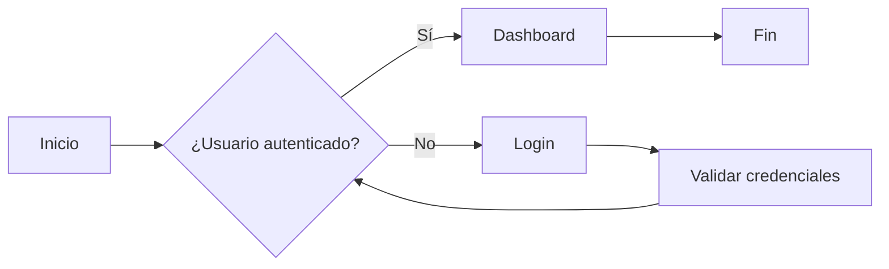
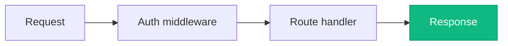
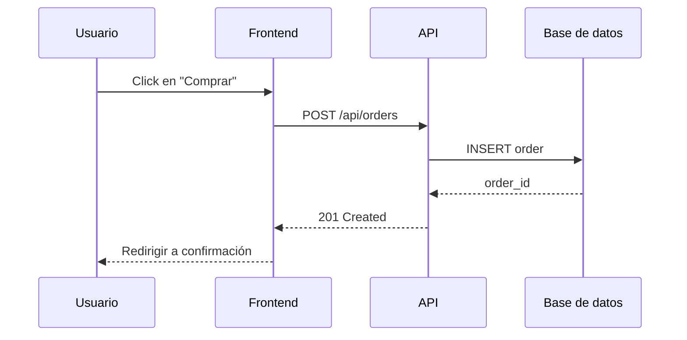
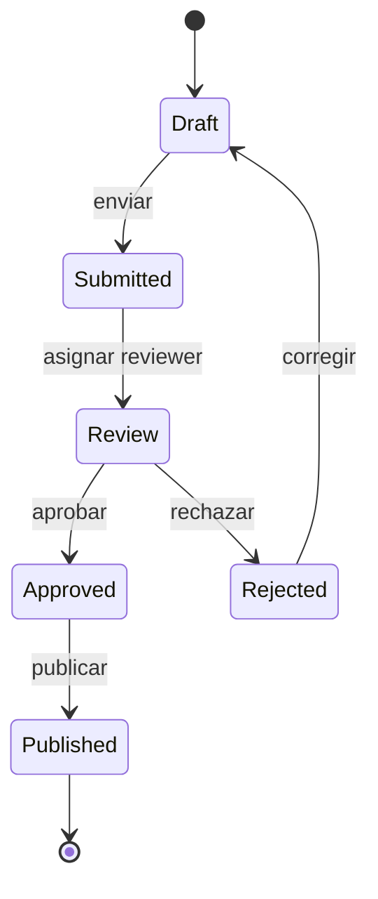
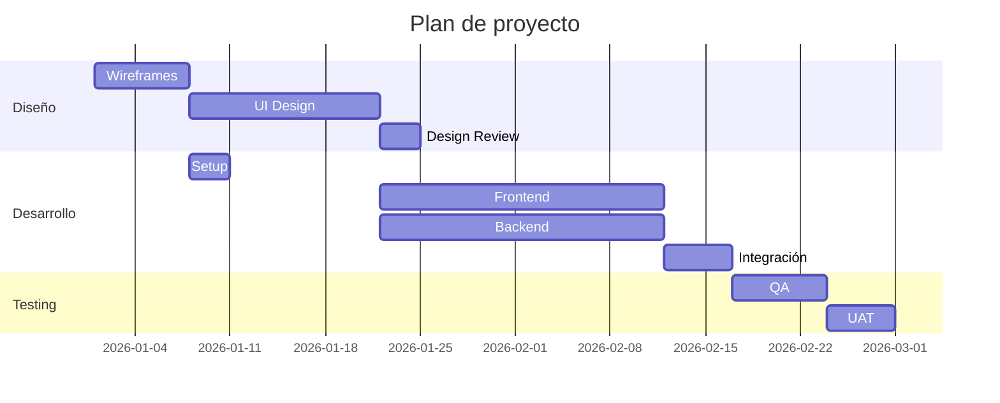
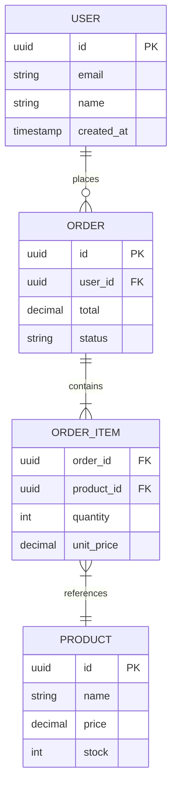
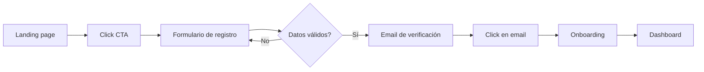
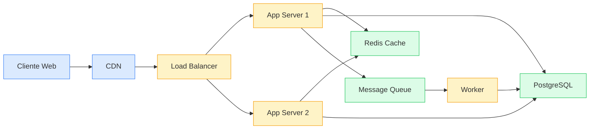
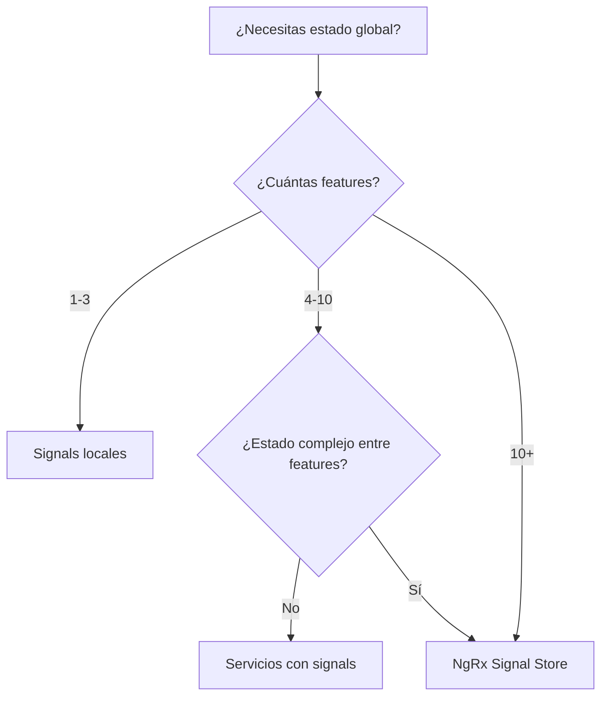

# Diagramas FigJam con Mermaid

Sintaxis Mermaid soportada por `Figma:generate_diagram` y patrones recomendados.

## Tipos soportados

- `graph` / `flowchart` — diagramas de flujo y árboles de decisión
- `sequenceDiagram` — interacciones entre actores/sistemas en el tiempo
- `stateDiagram` / `stateDiagram-v2` — máquinas de estado
- `gantt` — cronogramas y planning
- `erDiagram` — diagramas entidad-relación (DB schema)

**NO soportados**: class diagrams, timelines, venn diagrams, mind maps.

## Reglas de la herramienta

1. Mantener los diagramas **simples** (a menos que el usuario pida detalle)
2. Para `graph`/`flowchart`/`erDiagram`: usar dirección **LR** (left-right) por defecto
3. Texto de shapes y edges **siempre entre comillas**: `["Texto"]`, `-->|"Edge label"|`
4. **No usar emojis** en el código Mermaid
5. **No usar `\n`** para saltos de línea
6. En `gantt`: **no usar colores** (estilo fijo)
7. En `sequenceDiagram`: **no usar notas**
8. **No usar la palabra "end"** en classNames
9. Para `graph`/`flowchart` se permite **styling de color con moderación**

## Flowchart estándar



## Flowchart con styling



## Sequence diagram



## State diagram



## Gantt (cronograma)



## ER diagram



## Patrones comunes a generar

### User journey (como flowchart)



### Arquitectura de sistema (como flowchart con styling)



### Decision tree



### Flujo de autenticación

```mermaid
sequenceDiagram
    participant U as Usuario
    participant C as Cliente
    participant API as API
    participant Auth as Auth Service

    U->>C: Ingresa credenciales
    C->>API: POST /auth/login
    API->>Auth: Validar
    Auth-->>API: Token JWT
    API-->>C: { token, refresh_token }
    C->>C: Guardar en storage

    Note: requests subsiguientes
    C->>API: GET /resource (Bearer token)
    API->>Auth: Verificar token
    Auth-->>API: OK
    API-->>C: Datos
```

## Antes de llamar a `generate_diagram`

1. **Definir userIntent** claro: qué quiere lograr el usuario
2. **Generar el código Mermaid** mentalmente y validar:
   - Sintaxis correcta
   - Textos en comillas
   - Sin emojis ni `\n`
3. **Asignar un name** descriptivo (será el título del diagrama)
4. **Pedir confirmación al usuario** ("Voy a generar este diagrama en FigJam, ¿procedo?")
5. Si el usuario tiene un archivo FigJam abierto y quiere agregarlo ahí, **pasar `fileKey`**

## Manejo de errores comunes

- **"end" en nodos**: renombrar (ej: `End` por `Finish` o `EndNode`)
- **Caracteres especiales en texto**: usar comillas dobles siempre
- **Diagrama muy denso**: dividir en múltiples diagramas o simplificar
- **Mermaid version**: si una sintaxis nueva falla, simplificar a la versión clásica
