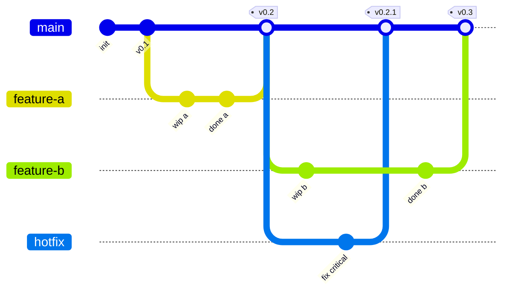
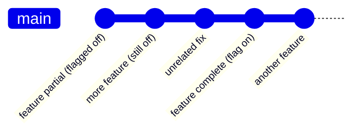
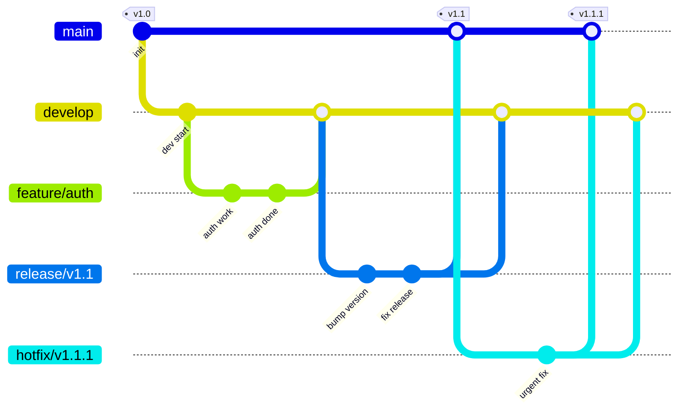
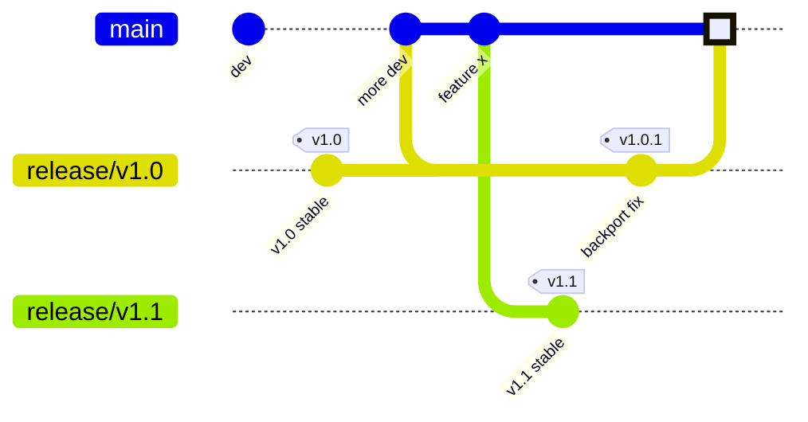

# Branching Strategies

Cuándo usar cada estrategia, con código y diagramas.

## Comparativa

| Estrategia | Complejidad | Deploys | Equipo | Paralelismo | Mejor para |
|---|---|---|---|---|---|
| **GitHub Flow** | Baja | Continuo | Cualquiera | OK | Webapps modernas, SaaS |
| **Trunk-based** | Baja | Múltiple/día | Senior, disciplinado | Excelente con feature flags | Cont. Delivery maduro |
| **GitFlow** | Alta | Por release | Cualquiera | OK | Software con versiones múltiples |
| **Release branches** | Media | Por release | Cualquiera | OK | Productos con LTS, hotfixes |

## GitHub Flow

El más simple. Una branch principal (`main`), feature branches que se mergean vía PR.

### Diagrama



### Workflow

```bash
# Crear feature branch desde main actualizado
git checkout main
git pull
git checkout -b feat/oauth-login

# Trabajar
git add .
git commit -m "feat(auth): add OAuth login button"
git push -u origin feat/oauth-login

# Abrir PR en GitHub/GitLab/etc
# Review, CI, etc.
# Mergear (squash & merge típicamente)

# Limpiar
git checkout main
git pull
git branch -d feat/oauth-login
```

### Reglas

- `main` siempre desplegable
- Branches efímeras (días, no semanas)
- Deploy desde `main` después de cada merge (idealmente automático)
- PRs pequeñas

### Pros / Cons

**Pros**:
- Simple de entender
- Mínimo overhead
- Funciona para CI/CD continuo

**Cons**:
- Requiere `main` siempre verde
- No maneja versiones paralelas
- Hotfixes y features compiten por `main`

### Cuándo elegir

✅ Webapps modernas, SaaS
✅ Equipos de cualquier tamaño
✅ Despliegues frecuentes
❌ Software que mantiene múltiples versiones en paralelo
❌ Equipos sin disciplina de tests

## Trunk-based Development

Todos commitean a `main` (o a branches muy cortas, <1 día). Combinado con **feature flags** para esconder código incompleto.

### Diagrama



### Workflow

**Opción A**: directo a `main`
```bash
git checkout main
git pull --rebase
# Hacer cambio pequeño (1-2 horas máx)
git add .
git commit -m "feat(api): add health check endpoint"
git push
```

**Opción B**: branch muy corta
```bash
git checkout main
git pull --rebase
git checkout -b feat/health-endpoint
# Trabajar < 1 día
git commit -m "feat(api): add health check endpoint"
git push
# PR breve, merge mismo día
```

### Feature flags

Para features grandes, dividir en commits seguros + flag:

```typescript
if (featureFlags.newCheckout) {
  return <NewCheckoutFlow />;
}
return <OldCheckoutFlow />;
```

Cuando feature está completa y testeada, activar flag para users. Cuando estable, eliminar flag y código viejo.

### Reglas

- Commits a `main` deben ser seguros (no rompen build)
- Feature flags para código incompleto
- Tests robustos (CI rápido y confiable)
- Code review puede ser pre o post-commit (algunos equipos hacen post)

### Pros / Cons

**Pros**:
- Menos merge conflicts (cambios pequeños constantes)
- Continuous integration real
- Mejor para equipos grandes con muchos cambios

**Cons**:
- Requiere madurez (tests, feature flags)
- No para todos los equipos
- Feature flags acumulados son deuda técnica

### Cuándo elegir

✅ Equipos maduros con CI/CD robusto
✅ Multiple deploys por día
✅ Feature flags como práctica establecida
❌ Tests débiles (un commit malo rompe todo)
❌ Equipos junior sin disciplina

## GitFlow

Modelo clásico con múltiples branches de larga duración. Creado por Vincent Driessen (2010). **Hoy considerado overkill para webapps**.

### Branches

- **main**: producción
- **develop**: integración de features
- **feature/***: nuevas features
- **release/***: preparación de release (testing, version bump)
- **hotfix/***: fixes urgentes en producción

### Diagrama



### Workflow

```bash
# Feature
git checkout develop
git pull
git checkout -b feature/new-thing
# trabajar
git checkout develop
git merge --no-ff feature/new-thing
git push

# Release
git checkout develop
git checkout -b release/v1.1
# bump version, last fixes
git checkout main
git merge --no-ff release/v1.1
git tag -a v1.1 -m "Release 1.1"
git checkout develop
git merge --no-ff release/v1.1

# Hotfix
git checkout main
git checkout -b hotfix/v1.1.1
# fix
git checkout main
git merge --no-ff hotfix/v1.1.1
git tag -a v1.1.1
git checkout develop
git merge --no-ff hotfix/v1.1.1
```

### Pros / Cons

**Pros**:
- Manejo explícito de releases
- Hotfixes claros
- Versiones paralelas posibles

**Cons**:
- Complejo (muchas branches)
- Mucho overhead para webapps con CD
- Merge conflicts entre develop/main son comunes
- El propio autor recomendó NO usarlo para webapps modernas

### Cuándo elegir

✅ Software con releases periódicos (no continuo)
✅ Necesidad de soportar versiones múltiples
✅ Productos con cliente que controla cuándo actualizar
❌ SaaS con deploy continuo (overkill)
❌ Equipos chicos
❌ Webapps con un solo entorno productivo

## Release Branches

Variante simplificada de GitFlow. `main` para desarrollo, `release/*` para versiones.

### Diagrama



### Workflow

```bash
# Desarrollo en main
git checkout main
# ... features mergeadas

# Cuando se quiere release
git checkout -b release/v1.1 main
git tag -a v1.1 -m "Release 1.1"
git push --tags

# Hotfix en v1.0 (release vieja)
git checkout release/v1.0
git checkout -b hotfix/v1.0.1
# fix
git checkout release/v1.0
git merge --no-ff hotfix/v1.0.1
git tag -a v1.0.1
git push --tags

# Backport el fix a main si aplica
git checkout main
git cherry-pick <commit-hash>
```

### Cuándo elegir

✅ Productos con LTS (Long Term Support)
✅ Múltiples versiones soportadas en paralelo
✅ Más simple que GitFlow

## Forking workflow

Cada contribuidor tiene su fork del repo. PRs cross-repo.

### Diagrama

```
upstream (origin org)
  ├── fork user-a → PR
  ├── fork user-b → PR
  └── fork user-c → PR
```

### Workflow

```bash
# Setup inicial
git clone https://github.com/yo/proyecto.git
cd proyecto
git remote add upstream https://github.com/org/proyecto.git

# Sync con upstream
git fetch upstream
git checkout main
git merge upstream/main
git push origin main

# Feature
git checkout -b feat/something
# trabajar
git push origin feat/something
# PR desde tu fork → upstream
```

### Cuándo elegir

✅ Open source público (default en GitHub OSS)
✅ Contribuidores externos sin write access
❌ Equipos internos (overhead innecesario)

## Branch naming conventions

### Recomendado

```
feat/<descripción>          → feature
fix/<descripción>           → bug fix
refactor/<descripción>      → refactor
docs/<descripción>          → documentación
chore/<descripción>         → mantenimiento
hotfix/<descripción>        → urgente en producción
release/v<version>          → release branch
experiment/<descripción>    → exploratorio (no mergear)
```

Con número de ticket:
```
feat/PROJ-1234-oauth-login
fix/PROJ-5678-null-pointer
```

### Reglas

- `kebab-case`
- Descriptivo pero corto
- Sin caracteres especiales (espacios, mayúsculas)
- Prefijo de tipo claro
- No usar nombres genéricos (`fix`, `wip`, `tmp`)

## Branch lifetime

| Branch | Duración recomendada |
|---|---|
| `main` | Permanente |
| `develop` (si GitFlow) | Permanente |
| `feature/*` | 1-7 días |
| `fix/*` | 1-3 días |
| `hotfix/*` | Horas |
| `release/*` | 1-3 días (durante release) |
| `experiment/*` | Lo que dure |

**Branches > 2 semanas = problema**. Más merge conflicts, más rebases, más dolor.

## Anti-patterns

- ❌ Branches eternas (semanas/meses)
- ❌ Múltiples features en una sola branch
- ❌ Nombres vagos: `temp`, `wip`, `test`, `john-stuff`
- ❌ Merges sin tests verdes
- ❌ Mergear sin code review (en equipo)
- ❌ Force push a branches compartidas
- ❌ Trabajar directo en `main` (excepto Trunk-based)
- ❌ GitFlow para una webapp simple
- ❌ Mezclar estrategias dentro del mismo repo
- ❌ Tags movibles (deberían ser inmutables)

## Migración entre strategies

### GitFlow → GitHub Flow

1. Anunciar cambio al equipo
2. Mergear `develop` a `main`
3. Borrar `develop`
4. Setup branch protection en `main`
5. Documentar nuevo workflow
6. Eliminar referencias a `develop` en CI/scripts

### GitHub Flow → Trunk-based

1. Adoptar feature flags
2. Disciplina: tests robustos, CI rápido
3. Branches cada vez más cortas (días → horas)
4. Eventualmente: muchos commits directos a main

## Recomendación por contexto

| Contexto | Estrategia |
|---|---|
| Startup SaaS típica | GitHub Flow |
| Equipo grande con CD maduro | Trunk-based |
| Software empaquetado vendido a clientes | Release branches |
| Open source con muchos contribs externos | Forking |
| Mobile app con versiones en stores | Release branches |
| Webapp con un solo entorno | GitHub Flow |
| Producto enterprise con LTS | Release branches o GitFlow |

## Diagramas comparativos

### GitHub Flow

```
main: o-----o-----o-----o-----o-----o-----o
       \         /     \         /     \   /
        \       /       \       /       \ /
         o-----o         o-----o         o
         feat1           feat2          feat3
```

### GitFlow

```
main:     o------------o------------o (releases)
           \           /\           /
            \         /  \         /
develop:     o---o---o----o---o---o
              \     /\
               \   /  \
feat:           o-o   o (features)
```

### Trunk-based con feature flags

```
main: o-o-o-o-o-o-o-o-o-o (todos commits aquí, features detrás de flags)
```

## Checklist branching

- [ ] Estrategia documentada en CONTRIBUTING.md
- [ ] Naming convention clara
- [ ] Branch protection en `main` (y `develop` si aplica)
- [ ] No deletions, no force pushes en branches protegidas
- [ ] Require PR + reviews + status checks
- [ ] Branches mergeadas se borran automáticamente
- [ ] Branches > 2 semanas alertadas
- [ ] Tags inmutables
- [ ] Convención de versionado declarada (SemVer)
