# Diagramas en Documentación

Cuándo y cómo usar Mermaid, PlantUML, Excalidraw, Figma.

## Principio: diagrama con propósito

Un diagrama vale mil palabras **solo si clarifica**. Si lo agregas sin propósito, agrega ruido.

✅ Usar diagrama cuando:
- Estructura espacial importa (arquitectura)
- Flujo o secuencia compleja
- Relaciones entre entidades (ER)
- Estados y transiciones
- Timeline o fases

❌ NO usar diagrama cuando:
- Es solo lista (mejor bullets)
- Es solo tabla de datos (mejor tabla)
- Texto explica igual de bien
- El diagrama sería un blob inentendible

## Mermaid (recomendado por defecto)

**Por qué Mermaid**:
- Texto, no binario → versionable en Git
- Renderizado nativo en GitHub, GitLab, Notion, Docusaurus, MkDocs
- Cubre flowchart, sequence, ER, state, gantt, class, mindmap, timeline, etc.
- Edita = edita texto, no requiere tool gráfico

**Cuándo NO Mermaid**:
- Diagramas muy estilizados/pulidos para presentaciones → Figma
- UML estricto y complejo → PlantUML
- Sketches conceptuales informales → Excalidraw

### Flowchart

Para flujos de proceso, decisiones, arquitecturas simples.

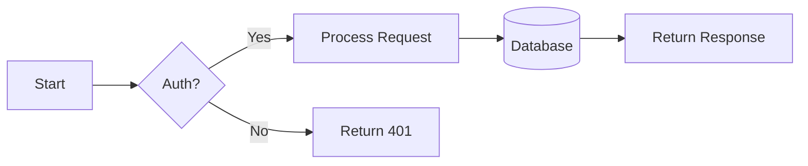

Direcciones: `TB` (top-bottom), `BT`, `LR`, `RL`.

Formas:
- `[ ]` rectángulo
- `( )` rectángulo redondeado
- `{ }` rombo (decisión)
- `[( )]` cilindro (DB/storage)
- `(( ))` círculo
- `> ]` flag
- `[/ /]` paralelogramo

### Sequence diagram

Para interacciones entre componentes/actores en el tiempo.

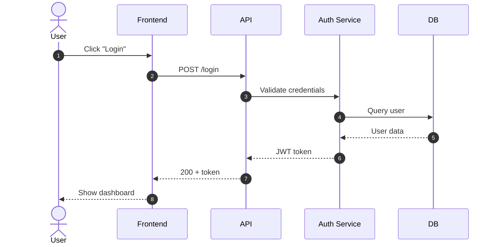

Flechas:
- `->>` mensaje normal
- `-->>` respuesta
- `->>+` activa lifecycle
- `->>-` desactiva
- `--x` mensaje perdido

Otros:
- `Note over A,B: Esto es una nota`
- `loop` para bucles
- `alt / else / end` para branches
- `par` para paralelo

### Entity Relationship

Para schemas de DB. Integra con skill `databases`.

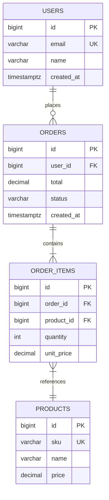

Cardinality:
- `||--||` one-to-one
- `||--o{` one-to-many
- `}|--|{` many-to-many (al menos uno cada lado)
- `}o--o{` many-to-many (opcional ambos lados)

### State diagram

Para máquinas de estado (orden lifecycle, conexiones TCP, etc.).

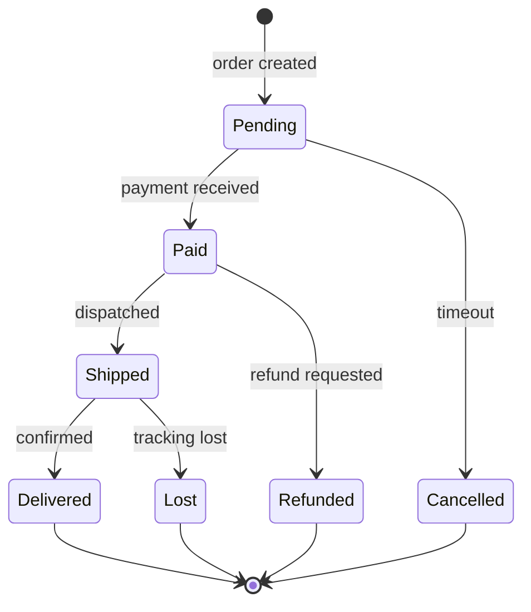

### Class diagram

UML clásico para diseño OO.

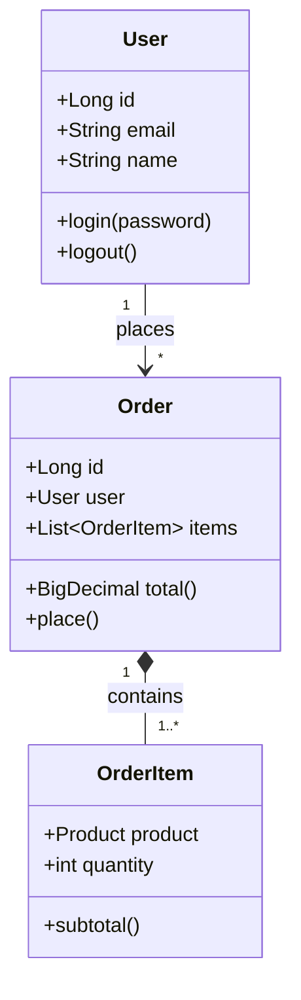

Relations:
- `<|--` herencia (extends)
- `*--` composición
- `o--` agregación
- `-->` asociación
- `..>` dependencia
- `..|>` realización (implements)

### Gantt

Para timelines de proyecto/release planning.

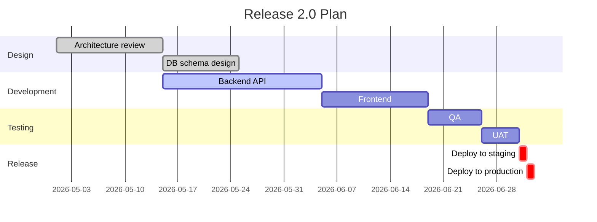

### Mindmap

Brainstorming, taxonomía, organización conceptual.

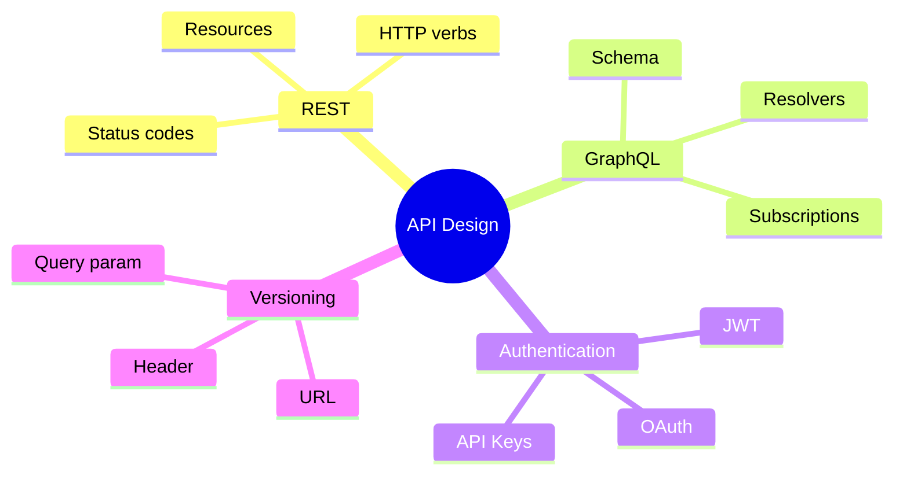

### Timeline

Para historia de un proyecto, decisiones, milestones.

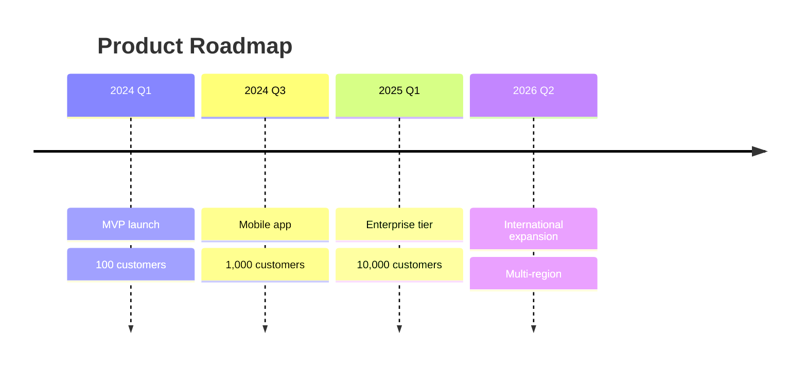

### Estilo y temas

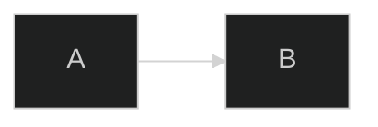

Themes: `default`, `dark`, `forest`, `neutral`, `base`.

Custom CSS para nodos:

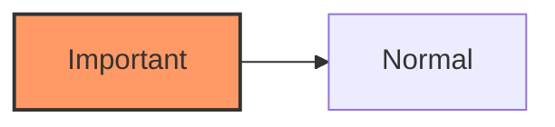

## PlantUML (UML estricto)

Cuando necesitas UML formal o capacidades avanzadas:

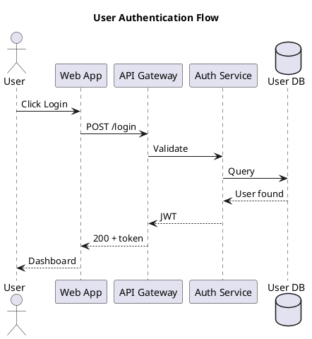

PlantUML soporta más tipos UML (component, deployment, activity, use case, etc.) y opciones de estilo más ricas.

**Render**:
- VSCode: extension PlantUML
- IntelliJ: built-in
- Online: https://www.plantuml.com/plantuml/
- En GitHub: no nativo. Usar action o link al PNG generado.

### Cuándo PlantUML > Mermaid

- UML estricto académico
- Diagramas de componentes/deployment complejos
- Activity diagrams con swim lanes
- Soporte de C4 model
- Más opciones de styling

### Cuándo Mermaid > PlantUML

- Render nativo en repos Git
- Diagrama típico de software
- Quieres editar y ver inmediatamente
- Equipo no quiere instalar nada

## C4 model

Framework para diagramas de arquitectura en 4 niveles:

1. **System Context** — sistema en su entorno
2. **Container** — apps, servicios, bases dentro del sistema
3. **Component** — bloques dentro de un container
4. **Code** — clases/funciones (raramente vale la pena diagramar)

Mermaid C4 (experimental):

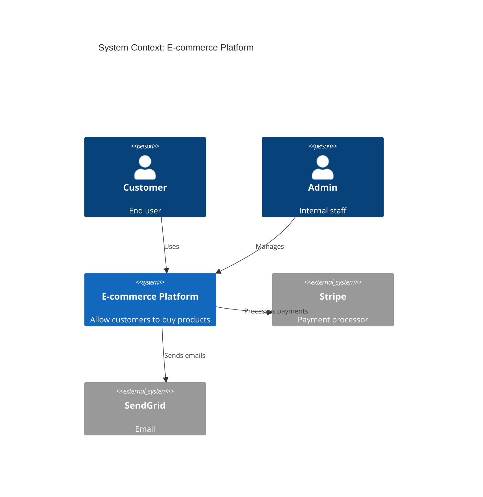

Container level:

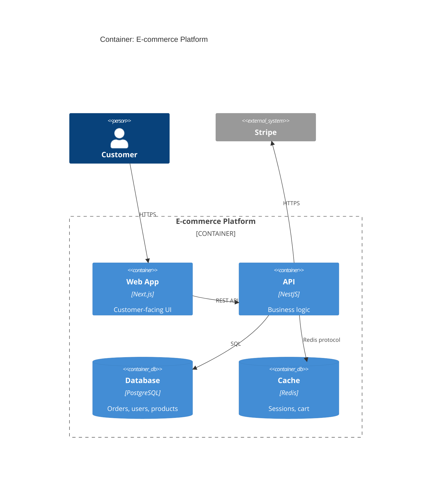

PlantUML tiene mejor soporte de C4 con la librería oficial.

## Excalidraw

Para sketches conceptuales informales. Hand-drawn look. Útil para:
- Whiteboarding remoto
- Brainstorming
- Diagramas "rough" en early stage
- Slides de discusión

Exportable a PNG/SVG. Source `.excalidraw` versionable en Git.

## Figma

Para diagramas de **alta calidad visual** en presentaciones, blogs, docs públicos. Coordina con la skill `figma-workflow` que ya tienes.

Cuándo Figma:
- Marketing material
- Docs públicas con branding
- Diagramas en presentaciones o pitches
- Templates reusables visuales

Para devs internos, Mermaid casi siempre es mejor (más rápido, versionable).

## ASCII art

Para README simples o diagramas inline en code comments:

```
┌─────────┐     ┌─────────┐     ┌─────────┐
│ Client  │────▶│ Gateway │────▶│ Service │
└─────────┘     └─────────┘     └─────────┘
                                      │
                                      ▼
                                 ┌─────────┐
                                 │   DB    │
                                 └─────────┘
```

Herramientas:
- https://asciiflow.com
- VSCode extensions

Cuándo:
- Code comments
- READMEs muy simples
- Cuando Mermaid no se renderiza

## Reglas generales

### Cantidad de información

❌ Diagrama con 50+ nodos: nadie entiende
✅ Foco en lo importante; detalles a sub-diagramas

### Niveles de zoom

Para arquitecturas complejas, **multiple diagramas en distinto nivel**:

1. System context (alto nivel) — el sistema completo
2. Container (medio) — apps dentro del sistema
3. Component (bajo) — bloques dentro de una app

Cada diagrama tiene UNA capa de detalle. Si necesitas más, otro diagrama.

### Naming consistente

- Componentes con mismo nombre en docs y código
- Acrónimos definidos
- Etiquetas claras (no "Service A")

### Direcciones de flujo

- Generalmente: arriba → abajo o izquierda → derecha
- Mantener convención en toda la doc
- Líneas que cruzan = mal layout

### Color con propósito

Usar color para significado, no decoración:
- Rojo = error, crítico
- Verde = success, healthy
- Amarillo = warning
- Gris = inactivo, fuera de scope

Accesibilidad: no depender SOLO de color (también shape o label).

### Mantenibilidad

- Diagrama desactualizado peor que sin diagrama
- Mermaid en repo = fácil actualizar
- Si tienes PNG generado, mantener source
- Auto-gen desde código cuando posible (terraform-docs, infracost-diagrams, etc.)

## Generación automática

Algunos diagramas pueden generarse desde código:

| Tipo | Herramienta |
|---|---|
| ER desde DB | SchemaSpy, DBeaver, mermaid-erd-cli |
| Class desde código | tplant (TS), pyreverse (Python) |
| Architecture desde Terraform | terraform-docs, inframap, rover |
| Sequence desde logs | Lots of tools (depend on stack) |
| Dependency graph | madge (JS), pydeps |

## Render

### GitHub/GitLab

Mermaid renderiza nativamente. PlantUML necesita workaround (GitHub Action que genera PNG).

### Docusaurus

```bash
npm install --save @docusaurus/theme-mermaid
```

```js
// docusaurus.config.js
themes: ['@docusaurus/theme-mermaid'],
markdown: { mermaid: true },
```

### MkDocs

Con `pymdown-extensions`:
```yaml
markdown_extensions:
  - pymdownx.superfences:
      custom_fences:
        - name: mermaid
          class: mermaid
          format: !!python/name:pymdownx.superfences.fence_code_format
```

### Sphinx

`sphinxcontrib-mermaid`:
```python
extensions = ['sphinxcontrib.mermaid']
```

### Notion

Mermaid embeds nativo en bloques de código.

### Confluence

Plugin "Mermaid Diagrams for Confluence" o macro custom.

## Checklist diagrama

- [ ] ¿El diagrama aporta valor sobre solo texto?
- [ ] Una idea por diagrama, no múltiples
- [ ] Naming consistente con código y otros docs
- [ ] Source versionable (Mermaid/PlantUML text, no PNG binario)
- [ ] Niveles de zoom apropiados (no todo en uno)
- [ ] Render correcto en la herramienta destino
- [ ] Color y forma con propósito
- [ ] Direcciones de flujo consistentes
- [ ] Sin información obsoleta
- [ ] Texto legible (no demasiado pequeño)
