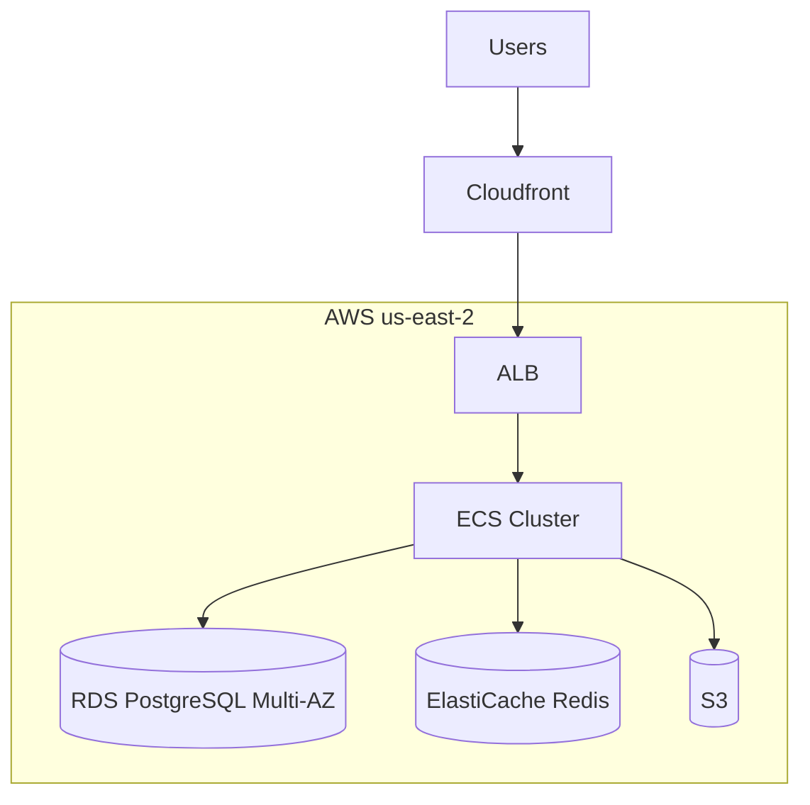

# Operational Documentation

Runbooks, postmortems, on-call docs.

## Runbooks

### Propósito

Pasos concretos para resolver una situación operativa. El lector está bajo presión (incidente activo, on-call a las 3 AM). Debe poder seguir sin pensar.

### Audiencia

- **On-call engineers** (incluidos nuevos)
- SRE / Operations
- Soporte técnico

### Principios

1. **Pasos atómicos**: cada uno una acción única
2. **Verificables**: cómo confirmar que el paso funcionó
3. **Copy-pasteables**: comandos completos, sin placeholders ambiguos
4. **Sin asumir conocimiento avanzado**: el on-call puede no conocer el servicio
5. **Cuándo escalar**: claro qué hacer si falla
6. **Probados**: ejecutados al menos una vez (drill)

### Template Runbook

```markdown
# Runbook: <Servicio/Sistema> — <Escenario>

> **Severity**: SEV-1 / SEV-2 / SEV-3
> **Owner**: @team-name (#team-channel)
> **Last verified**: 2026-05-19 by @user
> **Estimated duration**: 15-30 min

## Trigger

¿Qué activa este runbook? Síntomas observables:
- Alarma X dispara
- Reporte de usuario que dice Y
- Métrica Z arriba de threshold

## Impact

¿A quién afecta? ¿Cómo de grave?
- Servicio X caído / degradado
- Usuarios afectados: N% (estimar)
- Pérdida de datos: NO/SÍ

## Prerequisites

Antes de empezar:
- [ ] Acceso a AWS console (rol `oncall-prod`)
- [ ] Acceso a Datadog
- [ ] kubectl configurado para cluster prod
- [ ] Notificar en #incidents

## Diagnosis

### Paso 1: Verificar el estado actual

\`\`\`bash
kubectl get pods -n prod -l app=service-name
\`\`\`

Verifica:
- ¿Cuántos pods están Running vs Pending?
- ¿Restarts recientes?

### Paso 2: Revisar logs recientes

\`\`\`bash
kubectl logs -n prod -l app=service-name --tail=200 --since=10m
\`\`\`

Buscá patrones:
- `ERROR` o `FATAL`
- `OutOfMemory`
- `Connection refused`

### Paso 3: Métricas en Datadog

Dashboard: [link directo]

Mirá:
- CPU/memory > 80%?
- Latencia p99 > 1s?
- Error rate > 5%?

## Mitigation

### Opción A: Restart pods

Si los pods están degradados:

\`\`\`bash
kubectl rollout restart deployment/service-name -n prod
\`\`\`

Esperar:
\`\`\`bash
kubectl rollout status deployment/service-name -n prod
\`\`\`

### Opción B: Scale up

Si está saturado:

\`\`\`bash
kubectl scale deployment/service-name -n prod --replicas=10
\`\`\`

### Opción C: Rollback

Si el problema empezó tras un deploy:

\`\`\`bash
kubectl rollout undo deployment/service-name -n prod
\`\`\`

## Verification

Después de mitigar, confirma:

1. Pods Running:
   \`\`\`bash
   kubectl get pods -n prod -l app=service-name
   \`\`\`
   Todos en estado `Running`.

2. Health check OK:
   \`\`\`bash
   curl https://api.example.com/healthz
   \`\`\`
   Esperás: `{"status":"ok"}`

3. Error rate normal en Datadog (volver a < 1%)

4. No alarmas activas

## When to escalate

Escalá a @team-lead o servicio L2 si:
- No podés diagnosticar tras 15 min
- Mitigación intentada no funciona
- Impacto crece (más usuarios afectados)
- Data loss confirmado o sospechado
- Necesitas acceso/permisos que no tenés

Cómo escalar:
1. PagerDuty: "Escalate" en el incidente
2. Slack: tag @oncall-l2 en #incidents
3. Llamar a team lead si SEV-1

## After incident

1. Crear ticket con timeline
2. Si SEV-1 o SEV-2: organizar postmortem (ver template)
3. Update este runbook si descubriste algo nuevo

## Related

- Architecture: [link]
- Service README: [link]
- Postmortems anteriores: [links]
```

### Lista de runbooks típicos

Para una app web típica:
- Service down / unhealthy
- High latency
- High error rate
- DB connection exhausted
- Out of disk space
- Memory leak / OOM
- SSL cert expiring
- Auth provider down
- DDoS o spike de tráfico
- Deploy rollback
- Database failover
- Cache invalidation completa
- Backup restore (¡prueba antes!)

### Anti-patterns Runbook

- ❌ Pasos vagos: "Verifica los logs" sin decir cómo ni qué buscar
- ❌ Comandos placeholder: `kubectl get pods <YOUR_NAMESPACE>` sin decir cuál
- ❌ Asumir context: "Reinicia el servicio" sin decir cómo
- ❌ Sin "when to escalate" → on-call se queda atascado
- ❌ Sin "last verified": un runbook viejo es peligroso
- ❌ Sin verificar: pasos escritos pero nunca ejecutados
- ❌ Demasiado largo: divide en runbooks específicos
- ❌ Sin links a dashboards/herramientas

## Postmortems

### Propósito

Después de un incidente, analizar:
- ¿Qué pasó?
- ¿Por qué?
- ¿Cómo evitarlo?
- ¿Qué aprendimos?

### Blameless

**Crucial**: foco en sistemas y procesos, no en personas. Si las personas temen ser culpadas, ocultan información valiosa.

**Mal**: "Alice deployó código roto a las 2 PM."
**Bien**: "Un código con bug llegó a producción a las 2 PM porque el CI no detectó el caso."

### Cuándo escribir postmortem

| Severidad | Postmortem? |
|---|---|
| SEV-1 (crítico, customer-facing major) | Obligatorio |
| SEV-2 (alto, customer-facing significativo) | Recomendado |
| SEV-3 (medio) | Si hay learnings |
| SEV-4 (bajo) | Opcional |

### Template Postmortem

```markdown
# Postmortem: <Título corto del incidente>

* **Incident ID**: INC-2026-042
* **Date**: 2026-05-19
* **Severity**: SEV-1
* **Status**: Resolved
* **Duration**: 2h 15m
* **Authors**: @author1, @author2
* **Reviewed by**: @reviewer1, @reviewer2

## Summary

3-5 frases:
- Qué pasó
- Cuándo y por cuánto tiempo
- Qué se hizo
- Resultado final

## Impact

### User-facing
- N usuarios afectados (cómo se cuantificó)
- Funcionalidad caída: X, Y
- Datos perdidos: NO/SÍ (detalle)

### Internal
- Equipos afectados
- Costo estimado (si aplica)
- SLO breach

## Timeline

Todas las horas en UTC.

| Hora | Evento |
|---|---|
| 14:00 | Deploy de versión 3.7.0 a producción |
| 14:05 | Alarma "High error rate on /api/orders" se dispara |
| 14:07 | On-call (@alice) reconoce alerta en PagerDuty |
| 14:10 | Alice abre incidente en #incidents-active |
| 14:15 | Investigación inicial: logs muestran timeout connecting to DB |
| 14:20 | @bob se une, sospecha del nuevo connection pool config |
| 14:35 | Decisión: rollback a 3.6.0 |
| 14:42 | Rollback completado, métricas vuelven a normal |
| 15:00 | Confirmamos recuperación total, cerramos incidente |
| 16:15 | Customer-facing comm enviado |

## Root cause

**Lo que falló** (técnicamente):

El deploy 3.7.0 incluyó un cambio en `HikariCP` config que redujo `maximumPoolSize` de 30 a 5. Bajo tráfico real, el pool se agotó rápidamente, causando timeouts en queries a DB y cascada de errores.

**Por qué llegó a producción**:

1. El cambio se hizo "limpiando configs" sin entender el impact
2. PR fue aprobado sin notar el cambio (escondido entre muchos)
3. Tests pasaron porque el ambiente de test tiene baja carga
4. Canary deploy no detectó (canary fue 1% de tráfico por solo 5 min, insuficiente)

## What went well

- Alarma se disparó rápido (5 min después del deploy)
- On-call reaccionó en 2 min
- Rollback ejecutado en menos de 30 min total
- Comunicación interna fue clara

## What went wrong

- Tests no detectaron problema de carga
- Code review no notó cambio significativo
- Canary insuficiente para detectar
- Documentación interna sobre connection pool no existía

## Where we got lucky

- Era horario laboral; equipo respondió rápido
- El rollback fue limpio (cambio pequeño)
- No hubo data corruption

## Action items

| # | Action | Owner | Severity | Due | Status |
|---|---|---|---|---|---|
| 1 | Agregar test de carga al CI pipeline | @bob | High | 2026-05-30 | TODO |
| 2 | Documentar config crítica de HikariCP y proceso de cambio | @alice | High | 2026-05-26 | TODO |
| 3 | Aumentar duración de canary a 30 min y % tráfico | @carol | High | 2026-06-05 | TODO |
| 4 | Alarma específica para connection pool agotado | @bob | Medium | 2026-06-15 | TODO |
| 5 | Training: revisión de PRs y configs críticas | @team-lead | Medium | 2026-06-30 | TODO |

## Lessons learned

1. Cambios "limpieza" pueden ser críticos. Etiquetar configs sensibles.
2. Test environments deben simular mejor el load real.
3. Canary deployments necesitan tiempo y volumen suficiente.
4. Documentación de operación previene este tipo de errores.

## References

- Incident channel: #inc-2026-042
- PagerDuty incident: [link]
- Rollback PR: [link]
- Datadog dashboard durante incidente: [link]
- Related ADRs: [link]
```

### Reglas de postmortems

✅ Blameless (sin nombrar para culpar)
✅ Hechos antes que opiniones
✅ Timeline detallado y honesto
✅ Action items con owners y fechas
✅ Compartir con equipo amplio (learning)
✅ Revisar action items en sprint siguiente

❌ Buscar culpable
❌ Action items vagos ("mejorar testing")
❌ Postmortem que nadie lee después
❌ Sin owner para action items
❌ Quedarse en "qué pasó" sin "qué cambiamos"

## On-call documentation

### Template On-call Guide

```markdown
# On-call Guide: <Equipo/Servicio>

> Si estás on-call para este servicio por primera vez, leelo ANTES de tu shift.

## Schedule

- Rotación: [PagerDuty link]
- Duración del shift: 1 semana, viernes a viernes
- Horario: 24/7
- Pago/compensación: [link a policy]

## Responsibilities

### Durante el shift
- Responder a pages dentro de 15 min
- Triage y mitigación según runbooks
- Escalar si necesario (ver "Escalation")
- Documentar cada incidente en herramienta X
- Handoff al siguiente al final del shift

### Lo que NO se espera
- Resolver bugs complejos en código (eso es para semana laboral)
- Trabajar tareas no urgentes
- Estar 100% en computadora (pero sí responder pages)

## Escalation

| Tipo | Primer escalation | Segundo |
|---|---|---|
| Auth issues | @auth-team-oncall | Engineering Lead |
| DB issues | @data-team-oncall | DBA on-duty |
| Security incident | @security-oncall | CISO directly |
| Customer-facing major | Engineering Manager | VP Engineering |

Cómo escalar:
1. PagerDuty: "Escalate" en el incidente
2. Slack: page en #incidents
3. Llamar (números en [link al doc privado])

## Tools y accesos

Antes de tu primer shift verificá:
- [ ] PagerDuty: schedule visible, app instalada
- [ ] Slack: en #incidents, #oncall, #team-channel
- [ ] AWS Console: rol `oncall-prod` funcional
- [ ] Kubernetes: kubectl con context prod
- [ ] Datadog: acceso, dashboards bookmarkeados
- [ ] DBs: acceso read-only para diagnosis (sin write directo)
- [ ] VPN si es necesario

## Common issues y runbooks

| Síntoma | Runbook |
|---|---|
| 5xx spike | [Runbook: 5xx spike](runbooks/5xx-spike.md) |
| Latencia alta | [Runbook: high latency](runbooks/high-latency.md) |
| DB connection issues | [Runbook: db connections](runbooks/db-connections.md) |
| Out of disk | [Runbook: disk full](runbooks/disk-full.md) |
| Deploy failure | [Runbook: deploy rollback](runbooks/deploy-rollback.md) |

## Architecture overview

Servicios bajo tu responsabilidad:

\`\`\`mermaid
graph TB
    LB[Load Balancer] --> API[API Service]
    API --> DB[(PostgreSQL)]
    API --> Cache[(Redis)]
    API --> Queue[(SQS)]
    Queue --> Worker[Worker Service]
\`\`\`

Detalles: [Architecture doc](architecture.md)

## Severities

| Sev | Definition | Response time | Update freq |
|---|---|---|---|
| SEV-1 | Crítico, customer-facing major | 15 min | Cada 30 min |
| SEV-2 | Alto, customer-facing significant | 30 min | Cada hora |
| SEV-3 | Medio, no customer-facing | 1 hora | Cuando resuelva |
| SEV-4 | Bajo, mejora opcional | Next business day | - |

## Communications

### Internal
- `#incidents-active` durante incidente
- Update cada 30 min en SEV-1, cada hora en SEV-2
- Notification a stakeholders según matriz

### External (customer-facing)
- Status page: [link]
- Update inicial dentro de 1 hora si SEV-1
- Updates cada 30 min hasta resolución
- Postmortem público en blog si SEV-1 con impacto major

## Handoff

Al final de tu shift:
1. Resumen escrito en #oncall-handoff:
   - Incidentes activos
   - Tickets abiertos sin resolver
   - Cosas a vigilar
2. Sync verbal con el siguiente on-call (15 min)
3. Si hay incidente activo, no entregás hasta resolver
```

## Otros docs operacionales

### Service inventory

Lista de servicios con metadata:

```markdown
# Services Inventory

| Service | Owner | Repo | On-call | Runbook | Status |
|---|---|---|---|---|---|
| auth-api | @auth-team | [link] | [pagerduty] | [link] | Prod |
| orders-api | @commerce-team | [link] | [pagerduty] | [link] | Prod |
| reporting-svc | @data-team | [link] | [pagerduty] | [link] | Prod |
```

### Architecture overview (operacional, no de código)

Dónde corre cada cosa, cómo se conectan, qué pasa si X cae.



### Maintenance windows

```markdown
# Maintenance Windows

## Scheduled

| Date | Service | Type | Impact | Owner |
|---|---|---|---|---|
| 2026-06-15 02:00 UTC | RDS | Minor version upgrade | 5 min downtime | @data-team |

## Recurring

- **Daily**: Backup snapshots at 03:00 UTC (no downtime)
- **Weekly Sunday 04:00-05:00 UTC**: OS patches en EC2 (rolling, sin downtime)
```

## Checklist de docs operacionales

- [ ] Runbooks para los top 10 incidentes comunes
- [ ] On-call guide actualizada
- [ ] Service inventory con owners
- [ ] Escalation paths claros
- [ ] Postmortems históricos accesibles
- [ ] Status page para clientes externos (si aplica)
- [ ] Maintenance schedule visible
- [ ] Runbooks "last verified" date < 6 meses
- [ ] Drills periódicos (testear runbooks)
- [ ] Handoff process documentado
